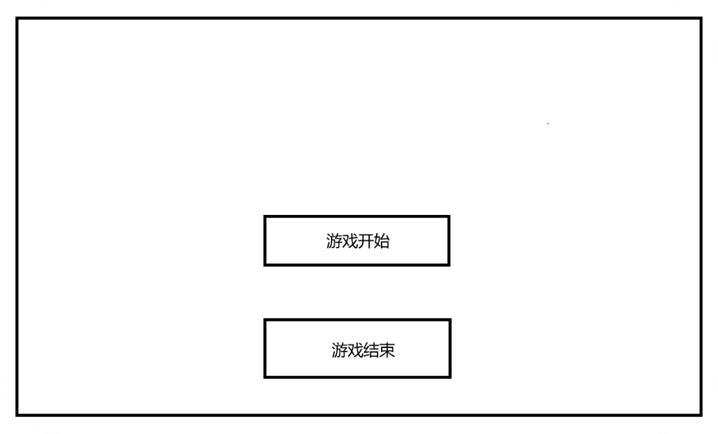
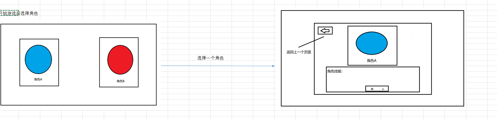
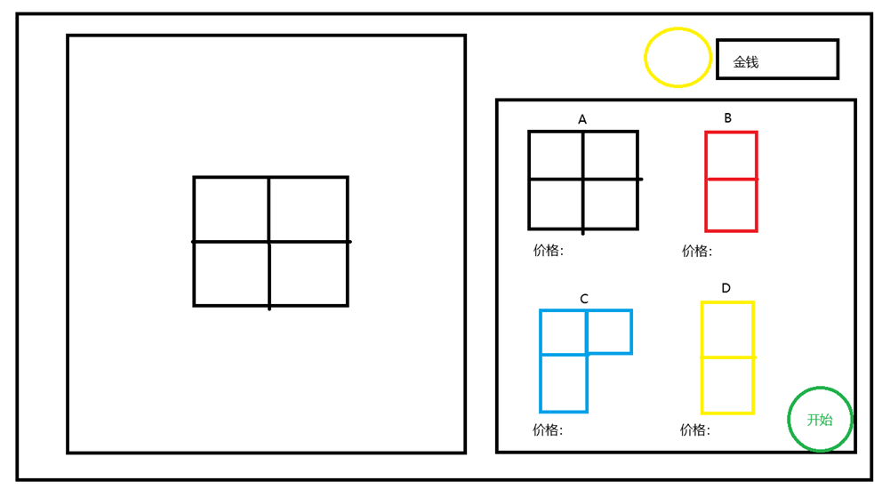
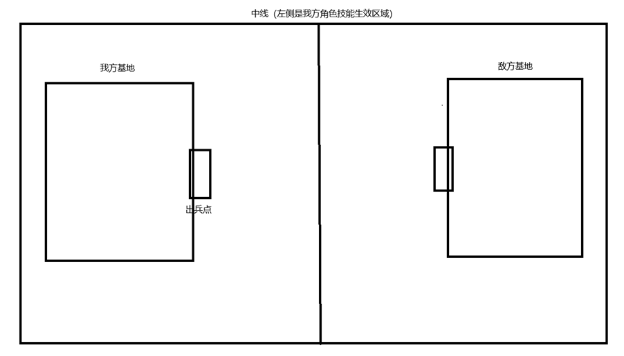

1. 开始游戏

2. 开始游戏后选择角色

	角色A技能：选择一个区域，放置一个直径为6（看着大小，我不太能预估大小）的圆形区域，持续10S，每2.5S生成两个攻击力为1，血量为5的角色，CD：30S									
										
	角色B技能：生成小兵时间减少5S，持续：30S，CD：60S									

3. 选择角色后进入游戏

左侧格数限制：最大格数6*6										
										
										
初始金钱：100		方块A：80，效果：扩展2*2								
		方块B：50，效果：放置后每6S生产一名小兵，小兵：1攻、10血，攻速：1次/S								
		方块C：100，效果：放置后每12S生产一名小兵，小兵：3攻、5血、攻速：1次/S								
		方块D：60，效果：与其相接的方块B或者C，增加2攻，2血								
										
将左侧的方块移到右侧的商店内，默认出售，每次出售为该方块-10块钱										
										
将右侧方块移到左侧后，自动吸附，同时扣钱										
										

4. 进入战斗

双方从我方基地到敌方基地，每个小兵都需要 15S秒时间，小兵移速雷老师你自己定吧						
						
						
敌方基地，我方基地，血量都为30						
						
成功过关后，我方基地不回血，增加100块钱						
						
过关后回到商店界面，进入后再次进行商店流程，然后进入关卡，没有通关，到死结束						
						
敌人配置，根据我方地块价值来，每次其地块的价格不得超过我方50块钱						
